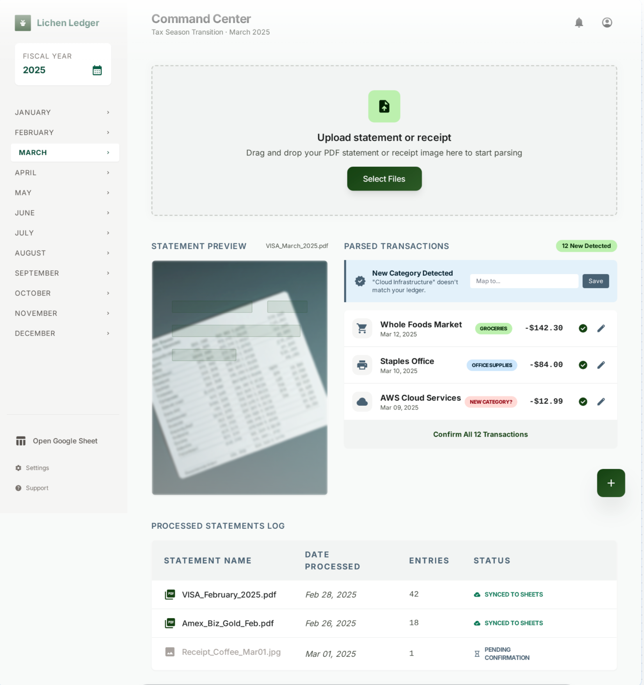
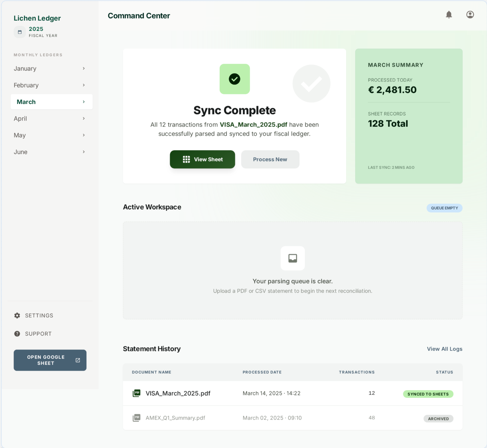

# Lichen Ledger

**Consulting Expense Tracker — Tax-Deductible Expense Extraction & Sync**

A full-stack web application that automates the tedious process of extracting tax-deductible business expenses from credit card and bank statement PDFs. Upload a statement, let Claude Vision parse every transaction into structured data, review and categorize in a clean UI, then sync approved rows directly to Google Sheets.

Built as **Project 1** for the [Claude Code in Practice](https://maven.com/boring-bot/claude-code-in-practice) course (Cohort 01, April 2026).

---

## The Problem

As a solo consultant, tracking tax-deductible expenses means downloading PDF statements every month, manually scanning pages for business transactions, and typing them into a Google Sheet. This takes 30-60 minutes per statement, is error-prone, and creates enough friction that it gets postponed — leading to a painful tax-season scramble.

**Lichen Ledger replaces manual scanning with AI-powered extraction.** Upload a PDF, review what Claude found, approve, and sync. Zero manual data entry beyond category confirmation.

---

## Screenshots

### Main Screen — Upload & Transaction Review


### Success Screen — Sync Confirmation


---

## Core Workflow

1. **Upload** — Drag and drop a credit card or bank statement PDF
2. **AI Parse** — Claude Vision extracts every transaction (date, vendor, amount, category) with real-time progress updates
3. **Review & Edit** — Transactions displayed in an editable table with category suggestions from your existing Google Sheet
4. **Approve** — Select which transactions to sync (individually or bulk approve)
5. **Sync to Sheets** — Approved rows written to the correct monthly tab via MCP
6. **Confirmation** — Summary of what was synced with a link to view the Sheet

---

## Key Features

- **Claude Vision PDF Parsing** — Converts PDF pages to images at 200 DPI, sends to Claude Sonnet for structured transaction extraction
- **Streaming Progress** — Real-time SSE updates during parsing ("Converting 4 pages..." → "Sending to Claude..." → "Found 23 transactions")
- **Intelligent Category Suggestions** — Claude uses your existing Google Sheet categories to suggest matches for new transactions
- **New Category Detection** — Alerts when a vendor doesn't match existing categories, with options to map or keep
- **Month Mismatch Warning** — Warns if the detected statement period doesn't match your selected month
- **Inline Transaction Editing** — Edit vendor, amount, category, notes before syncing
- **Year-Based Schema** — 2025 has 7 columns; 2026+ adds a Client field
- **Duplicate Detection** — Checks `processed_statements.md` log before processing to prevent double-counting
- **Demo Mode** — "Try Demo" button loads 15 sample transactions so you can test the full flow without API keys or Google Sheets

---

## Tech Stack

| Layer | Technology | Why |
|-------|-----------|-----|
| Frontend | React 19 + Vite + Tailwind CSS 3 | Fast setup, utility styling, hot reload |
| Backend | Python 3.13 + FastAPI | Async endpoints, good PDF library support |
| PDF Processing | PyMuPDF (fitz) | Converts PDF pages to images at 200 DPI |
| AI Parsing | Claude Sonnet via Anthropic SDK | Vision capability for reading statement images |
| Google Sheets | MCP (`@piotr-agier/google-drive-mcp`) | Avoids separate Google OAuth setup |
| Logging | Local markdown file | Simple duplicate detection, no database needed |

---

## Getting Started

### Prerequisites

- Python 3.11+
- Node.js 18+
- An Anthropic API key (for real PDF parsing)
- Google Sheets MCP setup (for syncing — optional, demo mode works without it)

### Setup

```bash
# Clone the repo
git clone https://github.com/lozierk/lichen-ledger.git
cd lichen-ledger

# Backend setup
cd backend
python -m venv .venv
source .venv/bin/activate
pip install -r requirements.txt

# Frontend setup
cd ../frontend
npm install
```

### Environment Variables

Create a `.env` file in the project root:

```
ANTHROPIC_API_KEY=sk-ant-...
GOOGLE_DRIVE_OAUTH_CREDENTIALS=/path/to/oauth-keys.json
GOOGLE_DRIVE_MCP_TOKEN_PATH=/path/to/mcp-token.json
SHEETS_2025_ID=your-2025-sheet-id
SHEETS_2026_ID=your-2026-sheet-id
```

### Running

```bash
# Terminal 1 — Backend (localhost:8000)
cd backend && source .venv/bin/activate && python main.py

# Terminal 2 — Frontend (localhost:5173)
cd frontend && npm run dev
```

Open **http://localhost:5173**

### Demo Mode (No API Keys Required)

If you don't have an Anthropic API key or Google Sheets configured, you can still test the full UI flow:

1. Start the backend and frontend as described above
2. Click **"Try Demo"** on the upload screen
3. 15 sample transactions from a fake Chase Ink Business statement will load
4. Review, edit, approve — the full flow works (sync will fail without Sheets, but everything else is functional)

---

## Architecture

```
Project_01/
├── backend/
│   ├── main.py                    # FastAPI app with 7 API endpoints
│   ├── models.py                  # Pydantic models (Transaction, ParseResult, SyncRequest, etc.)
│   ├── requirements.txt           # Python dependencies
│   └── services/
│       ├── llm_parser.py          # PDF→image→Claude Vision→structured JSON
│       ├── mcp_sheets.py          # Google Sheets read/write via MCP
│       └── log_service.py         # Duplicate detection via processed_statements.md
├── frontend/
│   ├── src/
│   │   ├── App.jsx                # Main orchestrator — state management, workflow
│   │   ├── api.js                 # API client (fetch wrappers + SSE streaming)
│   │   └── components/
│   │       ├── UploadZone.jsx     # Drag-and-drop upload + demo button
│   │       ├── TransactionList.jsx # Editable transaction table
│   │       ├── CategoryAlert.jsx  # New category mapping UI
│   │       ├── Sidebar.jsx        # Year/month navigation
│   │       ├── Header.jsx         # Sticky header with breadcrumb
│   │       ├── ProcessedLog.jsx   # Synced statements history table
│   │       └── SuccessBanner.jsx  # Post-sync confirmation screen
│   ├── tailwind.config.js         # "Lichen Ledger" theme (forest greens + slate blues)
│   └── vite.config.js             # Dev server proxy /api → localhost:8000
├── PRD_Lichen_Ledger_v2.md        # Product Requirements Document (v2)
├── CLAUDE.md                      # Claude Code project instructions
└── processed_statements.md        # Sync log for duplicate detection
```

### Data Flow

```
Upload PDF → Duplicate check → PDF→PNG (200 DPI) → Fetch existing categories
→ Claude Vision parse → User review/edit → Approve → Sync to Google Sheets
→ Log entry → Success confirmation
```

---

## API Endpoints

| Method | Endpoint | Description |
|--------|----------|-------------|
| GET | `/api/health` | Health check |
| GET | `/api/demo` | Returns sample transactions for demo mode |
| POST | `/api/upload` | Upload and parse a document (non-streaming) |
| POST | `/api/upload-stream` | Upload and parse with SSE progress events |
| GET | `/api/categories?year=` | Fetch existing categories from Google Sheet |
| GET | `/api/accounts?year=` | Fetch source accounts from Google Sheet |
| POST | `/api/sync` | Write approved transactions to Google Sheet |
| GET | `/api/log` | Read processed statements log |
| GET | `/api/summary/{year}/{month}` | Get transaction count/total for a month |

---

## PRD

The full Product Requirements Document is at [`PRD_Lichen_Ledger_v2.md`](PRD_Lichen_Ledger_v2.md). It includes:

- Problem statement and target user
- Prioritized features (P0 Must-Have / P1 Nice-to-Have / P2 Future)
- User stories for core workflow, category management, and edge cases
- 11-step agent workflow
- Success metrics (leading and lagging indicators)
- Open questions and prototype scope

---

## What's Next

- End-to-end testing with real PDF statements from different banks
- Category analytics on the success screen (breakdown by type)
- Multi-page statement preview navigation
- Receipt image upload (JPG/PNG)
- Improved error recovery for MCP connection failures

---

## Course Context

**Course:** [Claude Code in Practice](https://maven.com/boring-bot/claude-code-in-practice) — Cohort 01 (April 1-18, 2026)

**Assignment:** Project 1 — "Idea to PRD to Prototype"

**Deliverable:** Complete refined PRD + working clickable prototype of core feature

**Author:** Kurt Lozier

**Built with:** Claude Code
